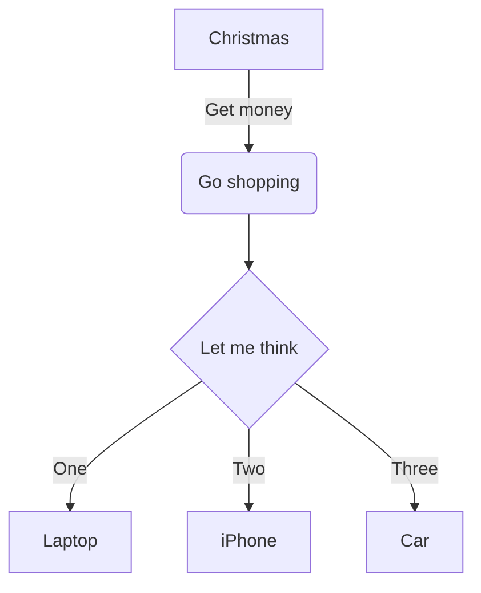

mermaid: true

例如本篇文章的配置：

---
layout: post
title: Github 博客画流程图
category: how2blog
tags: [tools, study, markdown]
mermaid: true
---

```mermaid
graph TD
A[Christmas] -->|Get money| B(Go shopping)
B --> C{Let me think}
C -->|One| D[Laptop]
C -->|Two| E[iPhone]
C -->|Three| F[Car]
```
